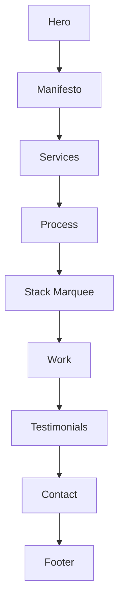

# GRAPHIFY — rarestar.studio codebase context

**Use:** `@GRAPHIFY.md` for agent context. **Brand:** RareStar. **URL:** `https://rarestar.studio`.
This document serves as the high-fidelity source of truth for the RareStar agency site architecture and patterns.

---

## Technical Core

| Axis | Implementation |
|------|----------------|
| **Framework** | Next.js 15+ (App Router), React 19, TypeScript |
| **Styling** | Tailwind CSS 4.0 (CSS-first), Vanilla PostCSS |
| **Animation** | GSAP 3 (ScrollTrigger), Lenis (Smooth Scroll) |
| **Rendering** | Three.js (WebGL hero particle/mesh treatment) |
| **Content** | Static JSON (`src/data/case-studies.json`) + Dashboard |
| **Infrastructure**| Vercel Deployment, Resend (Email), Calendly (Booking) |

---

## UI Architecture

### 1. Global Components (Layout)
These components wrap the entire application in `src/app/layout.tsx`:

- **Nav**: Dynamic fixed header with section tracking and progress indicator.
- **SoundDesign**: Global audio toggle + lightweight UI feedback sound controller.
- **Cursor**: Custom GSAP-powered interactive cursor (Desktop only).
- **ScrollProgress**: Fixed top bar indicating read progress.
- **SmoothScroll**: Lenis integration singleton.

### 2. Homepage Sections (`src/app/page.tsx`)
The site is a high-performance single-page experience:

---

## Feature Systems

### Case Study Dashboard
A lightweight admin tool located at `/dashboard/case-studies` for managing the `Work` section.

- **Storage**: Reads/Writes directly to `src/data/case-studies.json`.
- **Security**: Requires `CASE_STUDY_DASHBOARD_SECRET` (env).
- **Persistence**: 
  - **Local**: Direct `fs` write for seamless dev workflow.
  - **Production (Vercel)**: Read-only; offers JSON download for manual commit.
- **API**: `src/app/api/case-studies/route.ts`.

### Contact Engine
- **Endpoint**: `POST /api/contact`
- **Logic**: Validates input, logs to console/server. 
- **Integrations**: Ready for Resend (email delivery) via block in route handler.
- **Scheduling**: Calendly integration controlled via `NEXT_PUBLIC_CALENDLY_URL`.

---

## Design Tokens & Utilities
Defined in `src/app/globals.css`:
- **Palette**: `bg-ink` (#0a0a0a), `text-paper` (#f5f5f5), `accent-ember` (#ff4d00).
- **Typography**: 
  - `Fraunces`: Display/Serif headings.
  - `Inter`: Body/Sans UI.
  - `JetBrains Mono`: Technical/Caption text.
- **Classes**: `.display`, `.eyebrow`, `.grain` (noise overlay).

---

*Last updated: 2026-04-25. Update this file when adding new routes or changing the data schema.*

